# 🪙 DeepCoin-Core: Industrial AI for Archaeological Numismatics

[](https://www.python.org/)
[](https://pytorch.org/)
[](https://fastapi.tiangolo.com/)
[](https://nextjs.org/)
[](LICENSE)

> **DeepCoin is an end-to-end industrial AI solution designed to identify, classify, and analyze degraded archaeological coins. By combining Deep Learning (CNNs) for physical feature extraction and Generative AI (LangGraph Agents) for historical reasoning, DeepCoin transforms raw, corroded numismatic data into verified historical reports. Built with a scalable microservices architecture using FastAPI, Next.js, and AWS (via LocalStack).**

---

## 🎯 Project Overview

**DeepCoin-Core** is an end-to-end industrial AI solution that bridges the gap between **computer vision** and **historical intelligence** for archaeological numismatics. The system combines:

### **Core Innovation: Two-Stage AI Pipeline**

1. **Deep Learning Stage (Physical Analysis)**
   - **EfficientNet-B3 CNN** trained on 7,677+ ancient coin images
   - Handles severe degradation: corrosion, wear, fragmentation
   - CLAHE preprocessing reveals hidden surface details
   - Transfer learning from ImageNet for robust feature extraction

2. **Generative AI Stage (Historical Reasoning)**
   - **LangGraph multi-agent orchestration** for complex decision-making
   - **RAG (Retrieval-Augmented Generation)** with ChromaDB vector database
   - Synthesizes CNN predictions into verified historical narratives
   - Human-in-the-loop validation for quality assurance

### **Technology Stack Highlights**

- 🧠 **Deep Learning**: PyTorch 2.5, EfficientNet-B3, OpenCV preprocessing
- 🤖 **Agentic AI**: LangGraph state machines, GPT-4o-mini synthesis
- 📚 **RAG System**: ChromaDB vector database, semantic search
- ☁️ **Cloud-Native**: LocalStack AWS simulation (S3, Lambda)
- 🌐 **Web Stack**: Next.js 15 (React) + FastAPI + PostgreSQL
- 🐳 **DevOps**: Docker Compose, GitHub Actions CI/CD

### The Challenge

Archaeological coins are exceptionally difficult to classify due to:
- **Physical degradation**: Worn by centuries of circulation
- **Corrosion and patina**: Obscured surface details
- **Fragmentation**: Broken or incomplete specimens
- **Data scarcity**: Long-tail distribution with many rare types

### The Solution: Hybrid Deep Learning + Generative AI

**DeepCoin-Core** employs a two-stage intelligent pipeline:

#### **Stage 1: Deep Learning Classification**
1. **Preprocessing Engine**: CLAHE enhancement + aspect-preserving resize
2. **CNN Training**: EfficientNet-B3 fine-tuned on 438 coin classes
3. **Feature Extraction**: 1536-dimensional visual embeddings
4. **Prediction**: Softmax probabilities across coin types

## ✨ Key Features

### 🔬 Deep Learning Computer Vision Pipeline
- **EfficientNet-B3** CNN (12M parameters) fine-tuned for numismatics
- **CLAHE enhancement** (LAB color space) reveals worn coin details
- **Aspect-preserving preprocessing** maintains coin geometry (299×299)
- **Transfer learning** from ImageNet → 10-100x less training data needed
- **Data augmentation** (rotation, brightness, elastic transforms)
### 🤖 Generative AI Agent Orchestration (LangGraph)
- **Orchestrator**: State machine with conditional routing & cycles
- **Vision Agent**: Wraps CNN inference + Grad-CAM visualization
- **Research Agent**: RAG system (ChromaDB + Wikipedia API + GPT-4o)
- **Validator Agent**: Historical consistency checks (dates, emperors, mints)
- **Synthesis Agent**: Markdown → PDF report generation with citations
### 🌐 Industrial Microservices Architecture
- **FastAPI** backend (async, type-safe, auto-documented API)
- **Next.js 15** frontend (React Server Components, TypeScript)
- **PostgreSQL** database (ACID compliance, JSONB support)
- **Redis** cache (session management, API rate limiting)
- **LocalStack** AWS emulation (S3 storage, Lambda inference)
- **Docker Compose** multi-container orchestration
- **Nginx** reverse proxy with load balancing
- **Vision Agent**: CNN-based classification pipeline
- **Research Agent**: RAG system with ChromaDB vector database
- **Validator Agent**: Historical consistency verification
- **Synthesis Agent**: Professional PDF report generation

### 🌐 Production-Ready Architecture
- **FastAPI** backend with async operations
- **Next.js 15** frontend with Server Components
- **PostgreSQL** for persistent storage
- **LocalStack** for AWS S3/Lambda simulation
- **Docker Compose** for orchestration

### 📊 Intelligent Decision Making
```
Confidence > 85%  → Auto-approve & log
Confidence 60-85% → Request human review
## 🏗️ System Architecture

### High-Level Architecture

```mermaid
graph TB
    START["📸 User Uploads Image"]
    PREPROCESS["🔧 CLAHE Preprocessing"]
    VISION["🧠 EfficientNet-B3 CNN"]
    GATEKEEPER{"🚦 Gatekeeper<br/>Route by Confidence"}
    INVESTIGATOR["🔍 Visual Investigator<br/>VLM Description"]
    VALIDATOR["⚖️ Forensic Validator<br/>Anomaly Detection"]
    HISTORIAN["📚 Historian<br/>RAG Retrieval"]
    HUMAN{"👤 Human Review?<br/>High-Risk Flag"}
    SYNTHESIS["📝 Editor-in-Chief<br/>Report Generation"]
    END["✅ Final Report"]
    
    START --> PREPROCESS
    PREPROCESS --> VISION
    VISION --> GATEKEEPER
    GATEKEEPER -->|"Confidence < 40%"| INVESTIGATOR
    GATEKEEPER -->|"Confidence 40-85%"| VALIDATOR
    GATEKEEPER -->|"Confidence > 85%"| HISTORIAN
    INVESTIGATOR --> SYNTHESIS
    VALIDATOR --> HUMAN
    HISTORIAN --> SYNTHESIS
    HUMAN -->|"Forgery/Unknown"| SYNTHESIS
    HUMAN -->|"Approved"| SYNTHESIS
    SYNTHESIS --> END
```



### LangGraph State Machine Flow

```python
# State Transitions (Pseudocode)
START → PREPROCESS → VISION → GATEKEEPER (Router)

if confidence > 0.85:
    GATEKEEPER → HISTORIAN → SYNTHESIS → END

elif 0.40 <= confidence <= 0.85:
    GATEKEEPER → VALIDATOR → HUMAN_CHECK → SYNTHESIS → END

else:  # confidence < 0.40
    GATEKEEPER → INVESTIGATOR → SYNTHESIS → END
```

### Detailed Component Flow

**1️⃣ Frontend Layer (Next.js 15 + TypeScript)**
- Image upload component (drag & drop)
- Real-time classification dashboard
- Confidence visualization charts
- PDF report viewer & download

**2️⃣ Backend API (FastAPI + Python)**
- `POST /api/classify` - Upload & classify coin
- `GET /api/history/{id}` - Retrieve historical context
- `GET /api/validate/{id}` - Expert review queue
- `WebSocket /ws` - Real-time agent progress streaming

**3️⃣ Deep Learning Inference Engine**
- CLAHE Preprocessing (OpenCV)
- EfficientNet-B3 Forward Pass (PyTorch)
- Softmax Probabilities (438 classes)
- Grad-CAM Attention Maps
- Output: `{"class": 3987, "prob": 0.87, ...}`

**4️⃣ Agentic Orchestrator (LangGraph State Machine)**
- Conditional routing (confidence-based)
- State persistence (checkpoints)
- Human-in-the-loop breakpoints
- Retry logic & error handling

**5️⃣ Multi-Agent System (The "Sovereign Squad")**

1. **The Gatekeeper (Orchestrator)** - Brain of the LangGraph state machine
   - Routes based on CNN confidence score
   - High confidence (>85%) → Historian
   - Medium confidence (40-85%) → Forensic Validator  
   - Low confidence (<40%) → Visual Investigator

2. **The Visual Investigator (Attribute Expert)** - Handles unknown/degraded coins
   - Uses Vision-Language Model (GPT-4o-mini) for visual description
   - Describes: "Silver metal, bearded profile, Greek inscription ΒΑΣΙΛΕΩΣ"
   - Ensures never returns empty "I don't know" response

3. **The Forensic Validator (Truth Seeker)** - Detects anomalies & forgeries
   - OpenCV analysis: color histograms, dimension verification
   - Cross-references physical properties vs historical records
   - Flags inconsistencies: "CNN says Gold Stater, but histogram shows 80% grey"

4. **The Historian (RAG Specialist)** - Retrieves historical intelligence
   - Queries ChromaDB vector database for precise context
   - Fetches: emperor biography, mint location, economic significance
   - No guessing - only verified historical sources

5. **The Editor-in-Chief (Synthesis Agent)** - Final report generator
   - Compiles all agent outputs into structured Markdown/PDF
   - Adds "Verified by Expert" badge if human review occurred
   - Professional citations and source attribution

**6️⃣ Decision Layer**
- ✅ Confidence > 85%: Auto-approve
- ⚠️ Confidence 60-85%: Human review
- 🚩 Confidence < 60%: Flag for expert

**7️⃣ Data Persistence Layer**
- **PostgreSQL**: Users, classifications, audit logs
- **ChromaDB**: Historical text embeddings (RAG)
- **Redis**: Session cache, API rate limiting
- **LocalStack S3**: Image storage (simulated AWS)                ┌──────────────┐
                   │  Synthesis   │
                   │    Agent     │
                   │ PDF Reports  │
                   └──────────────┘
```

---

## 🚀 Quick Start

### Prerequisites

- **Python 3.11+**
- **Node.js 18+** (for frontend, coming soon)
- **Docker & Docker Compose**
- **Git**

### Installation

```bash
# 1. Clone the repository
git clone https://github.com/ChaiebDhia/DeepCoin-Core.git
cd DeepCoin-Core

# 2. Create virtual environment
python -m venv venv

# Windows
venv\Scripts\activate

# Linux/Mac
source venv/bin/activate

# 3. Install dependencies
pip install -r requirements.txt

# 4. Download dataset (CN Dataset v1)
# Place in: data/raw/CN_dataset_v1/

# 5. Run data preprocessing
python src/data_pipeline/prep_engine.py
```

### Project Structure

```
DeepCoin-Core/
├── src/
│   ├── data_pipeline/      # Deep Learning data preprocessing
│   │   ├── auditor.py      # Dataset analysis & long-tail filtering
│   │   └── prep_engine.py  # CLAHE enhancement + resize pipeline
│   ├── core/               # CNN architecture & training
│   │   └── model_factory.py # EfficientNet-B3 model definition
│   ├── agents/             # Generative AI agents (LangGraph)
│   ├── api/                # FastAPI microservices backend
│   └── ...
├── data/
│   ├── raw/                # Original CN dataset (gitignored)
│   ├── processed/          # Preprocessed 299x299 images
│   └── metadata/           # Dataset statistics
├── models/                 # Trained model checkpoints
├── tests/                  # Unit & integration tests
├── notebooks/              # Jupyter notebooks for experiments
└── docker-compose.yml      # Multi-container orchestration
```

---

## 📊 Dataset

### Corpus Nummorum (CN) v1
- **Source**: [corpus-nummorum.eu](https://www.corpus-nummorum.eu/)
- **Total Images**: 115,160 ancient coin photographs
- **Original Classes**: 9,716 unique coin types
- **Challenge**: Severe long-tail distribution

### Our Filtered Dataset (Deep Learning Ready)
- **Filtered Classes**: 438 coin types (≥10 images each)
- **Total Images**: 7,677 preprocessed images
- **Average per Class**: 17.5 images
- **Format**: 299×299 RGB JPG (EfficientNet-B3 input size)
- **Preprocessing**: CLAHE enhancement + aspect-preserving resize
- **Train/Val/Test Split**: 70/15/15 stratified split

**Rationale**: CNNs require minimum 10 samples per class for reliable feature learning. Transfer learning from ImageNet reduces this requirement from thousands to tens of images.

---

## 🧠 Technical Deep Dive

### Stage 1: Deep Learning Pipeline

#### Image Preprocessing Engine

#### 1. CLAHE Enhancement
```python
# Convert to LAB color space (separates brightness from color)
lab = cv2.cvtColor(img, cv2.COLOR_BGR2LAB)
l, a, b = cv2.split(lab)

# Apply contrast enhancement to lightness channel only
clahe = cv2.createCLAHE(clipLimit=2.0, tileGridSize=(8,8))
l = clahe.apply(l)

# Merge back and convert to BGR
img = cv2.merge((l, a, b))
img = cv2.cvtColor(img, cv2.COLOR_LAB2BGR)
```

**Why LAB?** Enhances contrast without distorting coin colors.

#### 2. Aspect-Preserving Resize
- Maintain original aspect ratio
- Add black padding to reach 299×299
- No geometric distortion of coin features

#### CNN Architecture & Training

**EfficientNet-B3** Deep Learning Model:
- **Parameters**: 12M (optimized for mobile/edge deployment)
- **Input**: 299×299×3 RGB tensor
- **Backbone**: Pre-trained on ImageNet (1.2M images, 1000 classes)
- **Feature Extractor**: 1536-dimensional embeddings
- **Classifier Head**: Dropout (p=0.3) + Linear(1536 → 438)
- **Output**: 438-way softmax probabilities

**Training Pipeline**:
1. **Loss Function**: CrossEntropyLoss (multi-class classification)
2. **Optimizer**: AdamW (lr=1e-4, weight_decay=0.01)
3. **Scheduler**: CosineAnnealingLR (warm restarts)
4. **Data Augmentation**: 
   - Rotation (±15°)
   - Brightness/Contrast (±20%)
   - Elastic transforms (simulates coin deformation)
5. **Regularization**: Dropout + weight decay + early stopping
6. **Batch Size**: 32 (gradient accumulation for larger effective batch)
7. **Epochs**: 50 with early stopping (patience=10)

**Transfer Learning Justification**:
- ImageNet pre-training provides low-level features (edges, textures)
- Fine-tuning adapts high-level features to numismatic patterns
- Reduces training data requirement by 10-100x

### Stage 2: Generative AI Multi-Agent System (Coming Soon)

**Vision Agent** → Runs CNN inference  
**Research Agent** → Queries historical database (RAG)  
**Validator Agent** → Cross-references predictions  
**Synthesis Agent** → Generates PDF reports  

**Orchestrator**: LangGraph state machine with conditional routing

---


## 🛠️ Technology Stack

| Layer | Technology | Purpose |
|-------|-----------|---------|
| **Frontend** | Next.js 15, TypeScript, Tailwind CSS | Modern web UI |
| **Backend** | FastAPI, Python 3.11, Uvicorn | High-performance API |
| **ML/AI** | PyTorch 2.5, EfficientNet-B3, OpenCV | Computer vision |
| **Agent Orchestration** | LangGraph (State Machines) | Production-grade cycles & conditional routing |
| **Vision-Language Model** | GPT-4o-mini (OpenAI API) | Visual description for unknown coins |
| **Vector DB** | ChromaDB / Pinecone | RAG historical knowledge retrieval |
| **Computer Vision** | OpenCV (cv2) | Forensic analysis: histograms, dimension checks |
| **Database** | PostgreSQL, Redis | Persistence & caching |
| **Cloud Sim** | LocalStack | AWS S3/Lambda emulation |
| **DevOps** | Docker, GitHub Actions, Nginx | CI/CD & deployment |

---

## 📚 Key Concepts

### Long-Tail Distribution
A dataset where few classes have many samples, but most have very few. Our solution: filter classes with <10 images.

### Transfer Learning
Leverage ImageNet pre-training (1.2M images) → fine-tune for coins. **10-100x less data required**.

### CLAHE (Contrast Limited Adaptive Histogram Equalization)
Local contrast enhancement that reveals worn coin details without amplifying noise.

### Agentic Workflow
Multiple specialized AI agents collaborate (Vision + Research + Validator) instead of a single monolithic model.

### RAG (Retrieval-Augmented Generation)
Combine LLM generation with real-time document retrieval to prevent hallucinations.

---


## 🤝 Contributing

Contributions are welcome! Please:

1. Fork the repository
2. Create a feature branch (`git checkout -b feature/amazing-feature`)
3. Commit changes (`git commit -m 'Add amazing feature'`)
4. Push to branch (`git push origin feature/amazing-feature`)
5. Open a Pull Request

**Areas for Contribution**:
- Data augmentation strategies
- Model architecture experiments
- Agent prompt engineering
- Frontend UI/UX improvements

---

## 📄 License

This project is licensed under the MIT License - see [LICENSE](LICENSE) file for details.

---

## 🙏 Acknowledgments

- **Corpus Nummorum (CN)** for providing the archaeological dataset
- **PyTorch** and **torchvision** teams for excellent ML frameworks
- **LangChain** team for LangGraph agent orchestration tools
- **FastAPI** creators for the modern Python web framework

---

## 📞 Contact

**Author**: Dhia Chaieb  
**Institution**: ESPRIT - School of Engineering  
**Email**: dhia.chaieb@esprit.tn  
**LinkedIn**: [linkedin.com/in/dhiachaieb](https://linkedin.com/in/dhiachaieb)  
**GitHub**: [@ChaiebDhia](https://github.com/ChaiebDhia)  

**Project Link**: [https://github.com/ChaiebDhia/DeepCoin-Core](https://github.com/ChaiebDhia/DeepCoin-Core)  
**Company**: [YEBNI - Information & Communication](https://yebni.com)

---

## 🏆 Project Goals

### Technical Excellence
- **Accuracy**: Target >85% on test set
- **Speed**: <500ms inference time per image
- **Scalability**: Handle 1000+ concurrent requests (simulated)

### Innovation Impact
- **Portfolio Differentiator**: Stand out in fullstack/AI job applications
- **Technical Depth**: Demonstrate end-to-end system design skills
- **Modern Stack**: Showcase 2026 industry-standard technologies
- **Hybrid Architecture**: Combine Deep Learning + Generative AI effectively
- **Production-Ready**: Enterprise-grade microservices deployment

---

<div align="center">

**⭐ Star this project if you find it interesting!**

Built with ❤️ for archaeological preservation and AI innovation

</div>
